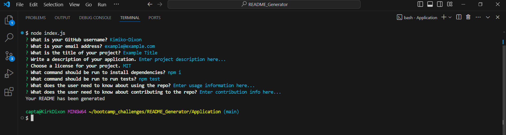
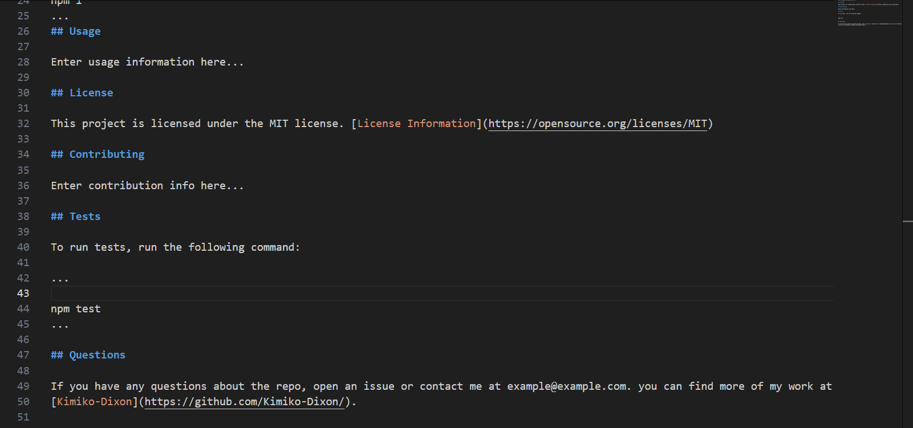

# Professional README Generator

## Description

This command line application allows the user to answer questions that pertain to writing a README for a project, and generates one using the user's answers.

## Installation

To install necessary dependencies, run the following command:

...

'npm i'
...

## Usage

To use this application, open the terminal in the index.js file, input 'npm index.js', and press 'Enter'. Answer the questions with the correct information for your project, pressing 'Enter' when you are finished answering each question. When you have finished answering the questions a README.md file will be generated using your answers. 

[Walkthrough Video](https://drive.google.com/file/d/10nBkQo9oiIWfKGi7AwCjp4wJAE_s-PUy/view?usp=drive_link)

 
 

## Credits

N/A

## License

LICENSE in repo.
